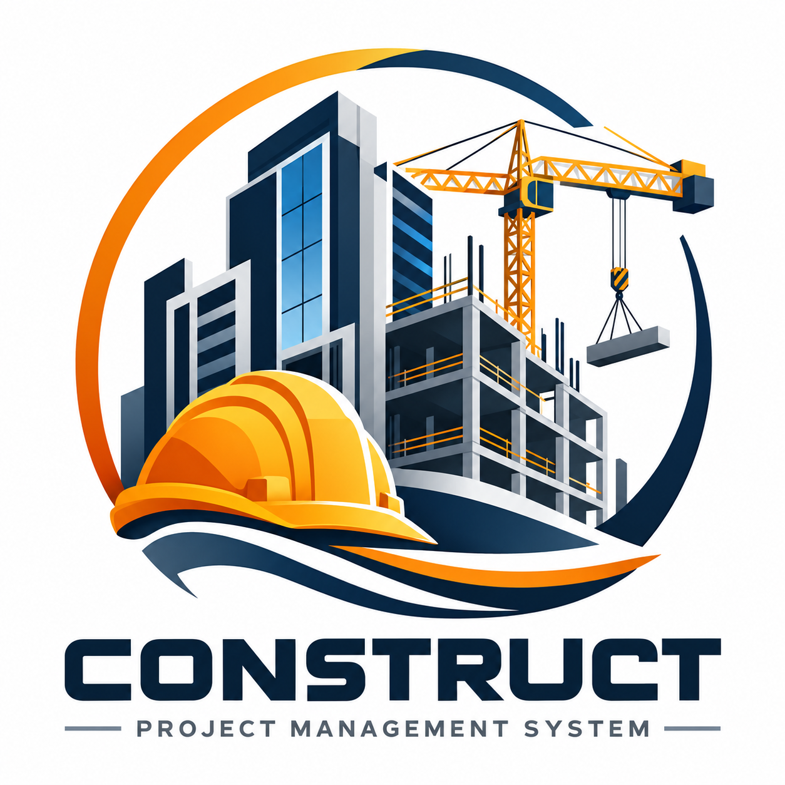

<p align="center">
  
</p>

<h1 align="center">🏗️ Construct Project Management System</h1>

<p align="center">
  A complete Django platform for managing construction projects, budgets, procurement, site operations, commercial workflows, documents, safety, and reporting.
</p>

<p align="center">
  
  
  
  
</p>

## 📖 Overview

Construct is an end-to-end construction project management application built with Django. It brings project controls, procurement, commercial management, field reporting, document control, safety, quality, tasks, approvals, and audit history into one role-aware workspace.

The application includes a responsive management dashboard, searchable module screens, CSV exports, a REST API, Django administration, demo data, notifications, and automatic audit logging.

## ✨ Key Features

| Area | Capabilities |
| --- | --- |
| 📊 Dashboard | Project status, progress, budget, committed cost, actual cost, workflow counts, overdue work, and recent audit activity |
| 🏢 Organization | Companies, departments, users, profiles, roles, partners, consultants, contractors, and suppliers |
| 🏗️ Project Control | Projects, contracts, project teams, activities, schedules, progress tracking, risks, and tasks |
| 💰 Cost Management | BOQ sections and items, budgets, variations, payment certificates, invoices, and cost comparisons |
| 🛒 Procurement | Materials, stock movements, purchase requests, purchase orders, and supplier records |
| 📝 Site Operations | Daily reports, site progress, labor and equipment records, defects, and field tasks |
| 📁 Document Control | Project documents, categories, revisions, uploads, RFIs, and response tracking |
| 🦺 HSE & Quality | Safety incidents, risk registers, defect tracking, priorities, owners, and resolution status |
| ✅ Workflows | Approval requests, review statuses, comments, notifications, and role-based actions |
| 🔍 Governance | Authentication, authorization, audit logs, current-user tracking, and Django admin tools |
| 🔌 REST API | Authenticated model APIs with filtering, search, ordering, pagination, and browsable endpoints |
| 📤 Reporting | Searchable lists, dashboard charts, summaries, and CSV exports |

## 🧰 Technology Stack

- 🐍 **Python 3.10+**
- 🌐 **Django 5.2.17**
- 🔌 **Django REST Framework 3.18.1**
- 🔎 **django-filter 26.1**
- 🗄️ **SQLite** for local development
- 🎨 **HTML, CSS, JavaScript, and Django Templates**
- 🛠️ **Django Admin** for administrative data management

## 🚀 Quick Start

### 1. Clone and enter the project

```bash
git clone <your-repository-url>
cd "Construction Project Management System"
```

### 2. Create a virtual environment

```bash
python -m venv .venv
```

Activate it on Windows PowerShell:

```powershell
.\.venv\Scripts\Activate.ps1
```

Activate it on Linux or macOS:

```bash
source .venv/bin/activate
```

### 3. Install dependencies

```bash
python -m pip install --upgrade pip
pip install -r requirements.txt
```

If your network requires trusted hosts:

```bash
pip install -r requirements.txt --trusted-host pypi.org --trusted-host files.pythonhosted.org
```

### 4. Apply database migrations

```bash
python manage.py migrate
```

### 5. Load demonstration data

```bash
python manage.py seed_demo
```

### 6. Start the development server

```bash
python manage.py runserver
```

Open the application at **http://127.0.0.1:8000/**.

## 🔐 Demo Accounts

Running `python manage.py seed_demo` creates these development accounts:

| Role | Username | Password |
| --- | --- | --- |
| 👑 System Administrator | `admin` | `admin123` |
| 👷 Project Manager | `pm` | `pm123` |
| 📐 Quantity Surveyor | `qs` | `qs123` |

> ⚠️ These credentials are for local demonstration only. Change or remove them before deploying the application.

## 👥 Roles and Access

| Role | Typical access |
| --- | --- |
| System Administrator | Full application and administration access |
| Company Administrator | Organization-wide setup, users, projects, workflows, and reports |
| Project Manager | Project controls, activities, reports, RFIs, documents, tasks, risks, and approvals |
| Quantity Surveyor | BOQ, budgets, contracts, variations, payment certificates, invoices, and commercial reporting |
| Site Engineer | Daily reports, activities, materials, RFIs, defects, safety, and site tasks |
| Procurement Officer | Materials, suppliers, purchase requests, purchase orders, and stock movements |
| Finance Officer | Budgets, payment certificates, invoices, and financial reporting |
| Consultant | Documents, RFIs, variations, EOT applications, reviews, and approvals |
| Contractor | Site reports, documents, RFIs, variations, EOT applications, payment claims, defects, and tasks |

Permissions are enforced by the application’s role-based access helpers and are reflected in navigation and allowed actions.

## 🧩 Core Modules

### 🏢 Organization and people

- Companies and departments
- User profiles and construction-specific roles
- Business partners, consultants, contractors, and suppliers
- Project team members and assignments

### 🏗️ Projects and planning

- Projects and project status tracking
- Contracts and contract values
- Activities, dates, progress, and dependencies
- Project tasks, priorities, assignees, and deadlines
- Risks, mitigation actions, owners, and status

### 💵 Commercial and cost control

- BOQ sections and detailed BOQ items
- Budget items by project and cost category
- Variations and extension-of-time applications
- Payment certificates and invoices
- Planned, committed, and actual cost visibility

### 📦 Procurement and inventory

- Material master records
- Stock receipt and issue movements
- Purchase requests with approval status
- Purchase orders linked to suppliers and projects

### 🏭 Site management

- Daily progress reports
- Labor, equipment, weather, and site notes
- Safety incidents and corrective actions
- Defects, responsibility, due dates, and closure tracking

### 📄 Communication and documents

- Document uploads and revision tracking
- Requests for information and responses
- Approval requests and workflow status
- In-app notifications and audit history

## 📊 Dashboard

The dashboard gives project teams a concise operational view of:

- Active and completed projects
- Project progress and status distribution
- Budget versus committed and actual costs
- Open RFIs, approvals, defects, risks, and procurement workflows
- Overdue tasks and RFIs
- Recent activity and audit-log entries

Dashboard information is filtered according to the signed-in user’s role and access level.

## 🔌 REST API

The authenticated browsable API is available at:

```text
http://127.0.0.1:8000/api/
```

Example endpoints include:

```text
/api/projects/
/api/rfis/
/api/documents/
```

The API supports session and basic authentication, pagination, field filtering, text search, and ordering. Example query patterns:

```text
/api/projects/?search=hotel
/api/projects/?ordering=-created_at
/api/rfis/?status=OPEN
```

## 🗂️ Project Structure

```text
Construction Project Management System/
├── config/                         # Django settings and root URL configuration
├── construction/                   # Main application
│   ├── management/commands/        # Demo-data command
│   ├── migrations/                 # Database migrations
│   ├── admin.py                    # Django admin registrations
│   ├── forms.py                    # Application forms
│   ├── middleware.py               # Current-user tracking
│   ├── models.py                   # Domain models
│   ├── permissions.py              # Role-based authorization
│   ├── serializers.py              # REST API serializers
│   ├── signals.py                  # Audit and workflow signals
│   ├── tests.py                    # Automated tests
│   ├── urls.py                     # Application and API routes
│   └── views.py                    # Pages, dashboards, exports, and APIs
├── docs/assets/                    # README and documentation assets
│   └── construct-logo.png          # Project README logo
├── static/construction/            # CSS, JavaScript, and application images
├── templates/                      # Shared and application templates
├── manage.py                       # Django command entry point
├── requirements.txt                # Python dependencies
└── README.md                       # Project documentation
```

## 🧪 Testing and Validation

Run the automated test suite:

```bash
python manage.py test
```

Run Django’s system checks:

```bash
python manage.py check
```

Create new migrations after changing models:

```bash
python manage.py makemigrations
python manage.py migrate
```

## 🛡️ Administration

Create an administrator manually when needed:

```bash
python manage.py createsuperuser
```

Then visit:

```text
http://127.0.0.1:8000/admin/
```

Authentication routes:

```text
/accounts/login/
/accounts/logout/
```

## 📤 CSV Exports

Management lists support filtered exports for operational reporting. Apply search and filter options in the relevant module, then export the current result set to CSV for spreadsheet review or sharing.

## ⚙️ Configuration Notes

- The development database is `db.sqlite3`.
- Uploaded files use Django’s configured media directory.
- Static files are served from the project static directories during development.
- The configured application timezone is `Asia/Colombo`.
- Development email behavior should be replaced with a production email provider before deployment.

## 🚢 Production Checklist

Before a production deployment:

- 🔑 Store `SECRET_KEY` and other secrets in environment variables.
- 📴 Set `DEBUG=False`.
- 🌍 Configure `ALLOWED_HOSTS` and trusted origins.
- 🐘 Move from SQLite to PostgreSQL or another production database.
- 📦 Run `python manage.py collectstatic` and configure static-file hosting.
- ☁️ Configure durable media or object storage and upload restrictions.
- 🔒 Enable HTTPS, secure cookies, HSTS, CSRF protection, and security headers.
- ✉️ Configure a real email backend for workflow notifications.
- 💾 Set up automated database and media backups.
- 👤 Review role permissions and remove demo credentials and sample data.
- 🖥️ Deploy with a production WSGI or ASGI server behind a reverse proxy.
- 📈 Add monitoring, error tracking, and centralized logs.

## 🛣️ Suggested Enhancements

- Background jobs with Celery and Redis
- Email and real-time workflow notifications
- PostgreSQL full-text search
- Cloud document storage and antivirus scanning
- PDF reports and branded certificates
- Advanced schedule and earned-value analytics
- Multi-company tenant isolation
- API token or OAuth authentication
- CI/CD pipelines and expanded automated test coverage

## 🤝 Contributing

1. Create a feature branch.
2. Keep changes focused and follow the existing Django structure.
3. Add or update tests for behavior changes.
4. Run `python manage.py check` and `python manage.py test`.
5. Open a pull request with a clear description and screenshots for UI changes.

## 📜 License

No license file is currently included. Add a `LICENSE` file before public distribution and update this section with the selected license.

---

<p align="center">
  Built for clearer construction planning, stronger cost control, and better project delivery. 🏗️
</p>
